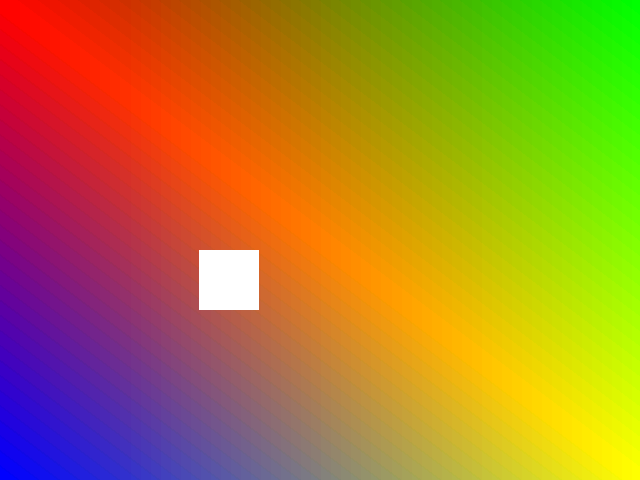
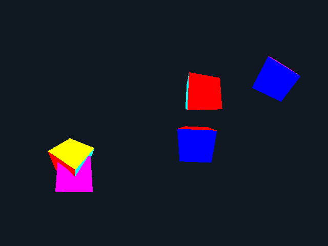
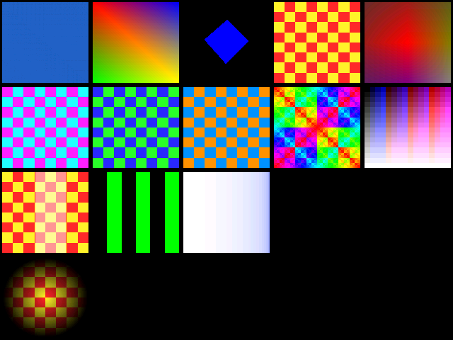
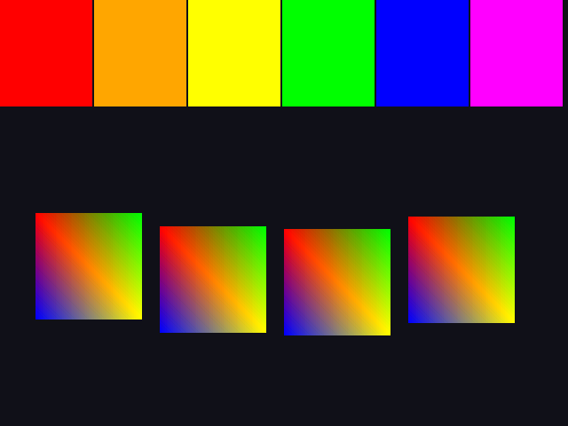
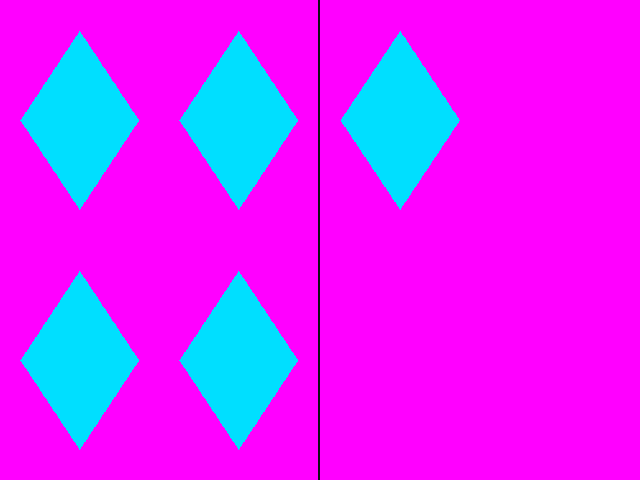
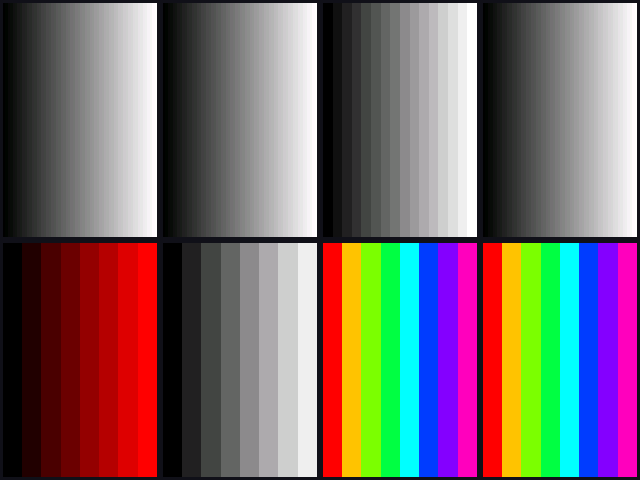
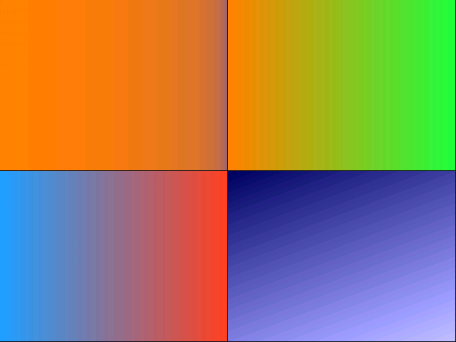
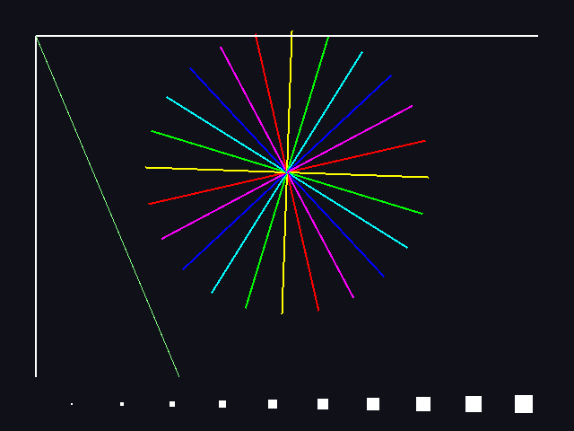
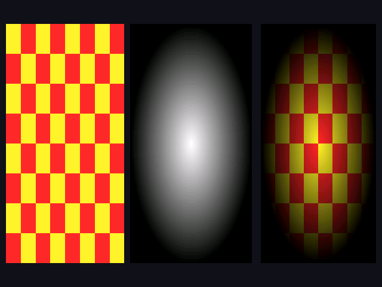
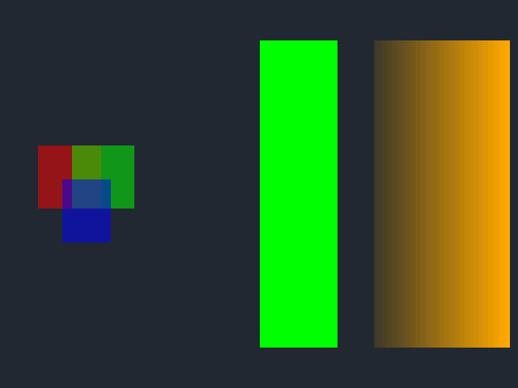

# smoltdfx

A tiny, freestanding (nolibc) userspace program that drives the **3dfx
Voodoo3** ("Avenger"/SST) **3D + 2D engine** directly, through a
`/dev/tdfx3d` misc device, as a visual test of the hardware.

The in-tree Linux stack has no 3D acceleration for the Voodoo3, and no
way to reach the card's registers from userspace. This program needs
some out-of-tree patches that add a misc device, `/dev/tdfx3d`, whose
`mmap()` exposes the card's register aperture (PCI BAR0: init/2D/3D
register spaces) and which provides a `TDFX3D_WAIT_VBLANK` ioctl.
Together with the `/dev/fbN` VRAM mapping this program renders directly
from the hardware registers — no X, no Mesa/Glide.

On top of this sits **[smolminigl](doc/smolminigl.md)** — a subset of
OpenGL 1.x on the Voodoo3, with a set of small OpenGL demos (written from
scratch, in the spirit of the classic teaching examples).

The demo has selectable scenes:

| `basic` | `cubes` | `grid` |
|:---:|:---:|:---:|
|  |  |  |

| `twod` | `clamp` | `texfmt` |
|:---:|:---:|:---:|
|  |  |  |

| `fog` | `minif` | `lines` |
|:---:|:---:|:---:|
|  |  |  |

| `rasterop` | `multitex` | `alpha` |
|:---:|:---:|:---:|
|  |  |  |

## Layout

- **`smoltdfx.h`** — a small header-only library that wraps the raw
  register pokes into a state-machine API: device bring-up, buffer
  layout, fast-fill clear, the setup unit (Gouraud/textured triangles),
  vblank-synced double-buffered present, and a diagnostics dump.
- **`tdfx3d_demo.c`** — the demo/visual test built on it.

## Validation

At start-up the demo renders one canonical frame (a fixed animation
phase) and prints a **digest** to the serial console — a whole-frame
checksum plus a fixed 8×6 grid of sampled RGB565 pixels — then animates.
The digest lets a QEMU run and a real-hardware run be compared directly.
Pass `dump` to also write the canonical frame to `/tmp/smoltdfx.ppm`.

## Command FIFO

By default smoltdfx submits each drawing command as a direct MMIO register
write. `smoltdfx_cmdfifo_init()` switches to a **DMA command FIFO**: a ring
carved from the top of VRAM that the card pulls commands from, so a batch of
register writes is committed with a single `bump` instead of one MMIO write
(a PCI transaction) each. It is transparent — the rendered result is
identical either way.

Pass `cmdfifo` to render a scene through it; the digest matches the PIO path
exactly (e.g. `grid` and `grid cmdfifo` both hash to `0x68432370`). This is
the submission route the higher-level GL layer uses.

Beyond the PKT1 register-write packets above, the ring carries a few more
packet types the GL layer relies on (all HW-validated by the probes in the
validation tree):

- **PKT3** — native setup-unit vertices: a whole triangle strip in one packed
  packet (≤15 verts each) instead of ~30 register writes per triangle.
- **PKT5** — a linear data burst (e.g. a texture upload) written straight into
  VRAM through the ring, so the payload never leaves the card's memory.
- **System-RAM ring** — `smoltdfx_cmdfifo_init_sysram()` puts the ring in
  DMA-coherent system RAM instead of VRAM (the AGP bit) for a bus-mastering
  card, leaving all of VRAM free for textures. Pass `cmdfifo-sysram` to run a
  scene through it (`grid cmdfifo-sysram` also hashes to `0x68432370`).

## Build

Needs a Linux source tree with the `/dev/tdfx3d` support for its in-tree
`nolibc` and the installed `<linux/tdfx3d.h>` uapi header:

    # once, in the kernel tree:
    make headers_install            # or: make O=build headers_install

    # here:
    make KDIR=/path/to/linux
    # out-of-tree kernel build: add HDRS=/path/to/linux/build/usr/include

## Run

    ./tdfx3d_demo [/dev/tdfx3d] [/dev/fb0] [basic|cubes|grid|twod|clamp]

Boot the card in a 16bpp mode first, e.g.
`tdfxfb.mode_option=640x480-16@60`.
