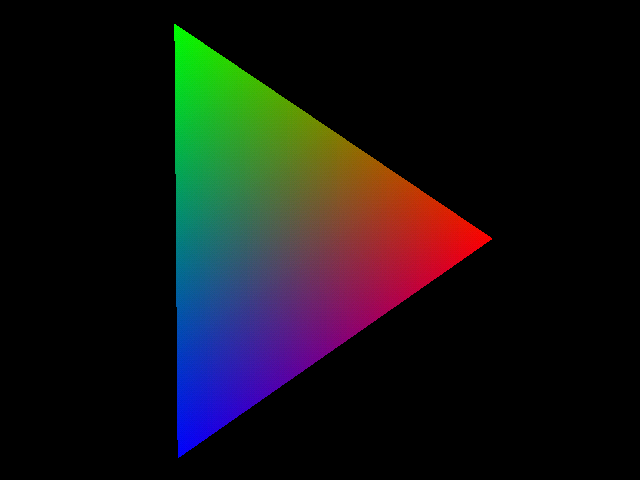
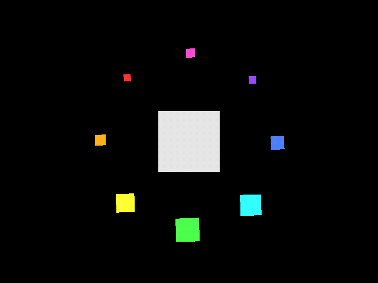
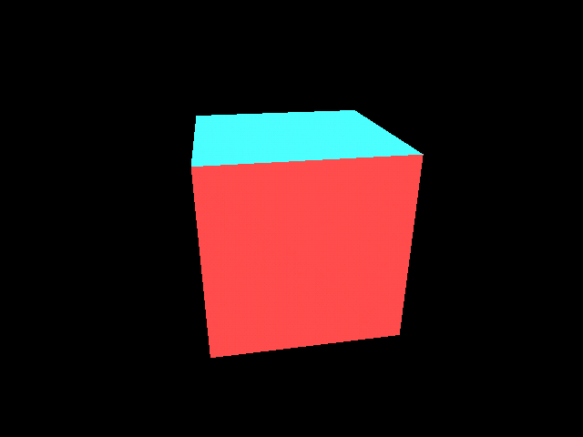
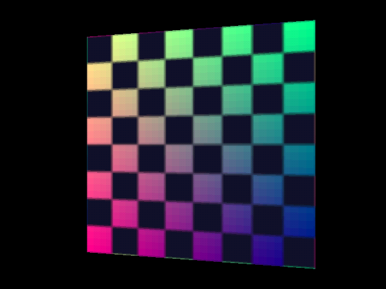
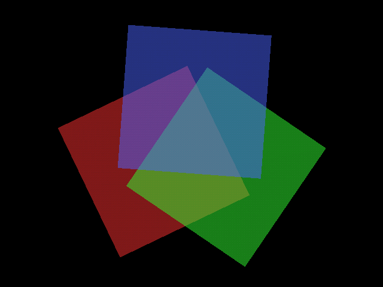
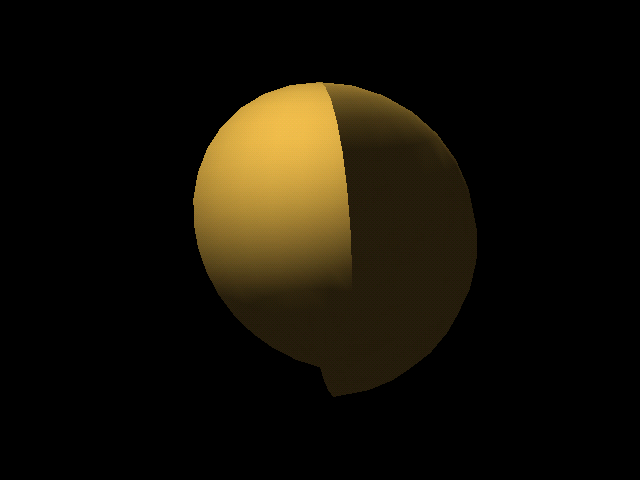

# smolminigl

`smolminigl` is a small subset of **OpenGL 1.x implemented on top of
[`smoltdfx`](../smoltdfx.h)** and the 3dfx Voodoo3. The Voodoo3 has no
transform/lighting unit, so smolminigl does the vertex pipeline on the CPU and
hands finished, screen-space triangles to the hardware rasteriser through
smoltdfx.

It exists so that ordinary OpenGL-1.x code — the kind of immediate-mode
programs in the classic teaching material — runs unmodified on the card, and so
the QEMU Voodoo3 model can be validated against real hardware with the same
digests smoltdfx uses.

## What it does

- **Software T&L, hardware rasterisation.** The matrix stack, per-vertex
  transform, viewport mapping and near-plane clipping run on the CPU (with
  [cglm](https://github.com/recp/cglm) for the matrix/vector maths); textured,
  blended, depth-tested triangles go to the Voodoo3 setup unit via smoltdfx.
- **Immediate mode.** `glBegin`/`glEnd` with `glVertex`, `glColor`,
  `glTexCoord`; `GL_TRIANGLES`, `GL_TRIANGLE_STRIP`, `GL_TRIANGLE_FAN`,
  `GL_QUADS`, `GL_POLYGON`, and the line/point primitives.
- **Matrices.** `glMatrixMode`, `glLoadIdentity`, `glLoadMatrixf`,
  `glMultMatrixf`, `glPushMatrix`/`glPopMatrix`, `glTranslatef`/`glRotatef`/
  `glScalef`, `glOrtho`, `glFrustum`, `glViewport`.
- **State.** depth test/write, blending, alpha test, fog, face culling, flat
  vs smooth shading, texturing (`glTexImage2D`/`glTexParameter`/`glTexEnv`,
  `glBindTexture`, mip chains).
- **Present.** `smolminigl_swap()` composites the finished offscreen buffer to
  the display via a vblank-synced 2D blit (no tearing).

Submission goes through smoltdfx's command FIFO when available (strips as PKT3
packets, texture uploads as PKT5 bursts); output is identical to the PIO path.

## Demos

The `redbook/` programs each teach one concept the way the classic OpenGL
Programming Guide examples do, but are written from scratch against smolminigl.
Each renders a canonical frame, prints a digest to the serial console (so a
QEMU run and a hardware run can be compared directly), then animates.

| demo | concept |
|---|---|
| `smooth` | Gouraud (smooth) shading — a triangle blended between three corner colours |
| `transform` | model transformations + the matrix stack — `glTranslatef`/`glRotatef`/`glScalef` with `glPushMatrix`/`glPopMatrix` |
| `cube` | perspective (`glFrustum`) + the depth buffer — a solid six-face cube whose near faces correctly occlude the far ones |
| `texquad` | texture mapping — `glTexImage2D` + `glTexCoord2f` wrap an image onto a quad, perspective-correct across a tilted surface |
| `blend` | alpha blending / transparency — `glBlendFunc(GL_SRC_ALPHA, GL_ONE_MINUS_SRC_ALPHA)` mixes three translucent quads into new colours where they overlap |
| `light` | diffuse (Lambert) shading — per-vertex `normal · light` computed on the CPU and Gouraud-interpolated across a lit sphere |

| smooth | transform |
|:---:|:---:|
|  |  |

| cube | texquad |
|:---:|:---:|
|  |  |

| blend | light |
|:---:|:---:|
|  |  |

## Build & run

    make redbook KDIR=/path/to/linux        # needs sibling ../cglm and ../stb checkouts
    ./redbook/smooth /dev/tdfx3d /dev/fb0    # on the target

Each demo is a single freestanding (nolibc) translation unit that `#include`s
`smolminigl.c`.  It is an ordinary program: it opens the two devices, renders,
and returns non-zero if the device cannot be opened.
